# Face Swap FAST API
[](https://www.python.org/)
[](https://fastapi.tiangolo.com/)
[](https://github.com/deepinsight/insightface)
[](https://www.mongodb.com/)

A REST API for face-swapping functionality built with FastAPI, OpenCV, and InsightFace.

## Features

- Public health endpoint
- Admin token management (create, retrieve, delete)
- Secure token-based authentication for face swap endpoint
- Face swapping between two images
- Automatic cleanup of processed images after 24 hours
- Usage tracking for tokens
- Face detection and swapping between two images
- Token-based authentication
- File upload/download
- Automatic cleanup of expired files
- High-quality face swapping using InsightFace

<div align="center">
  
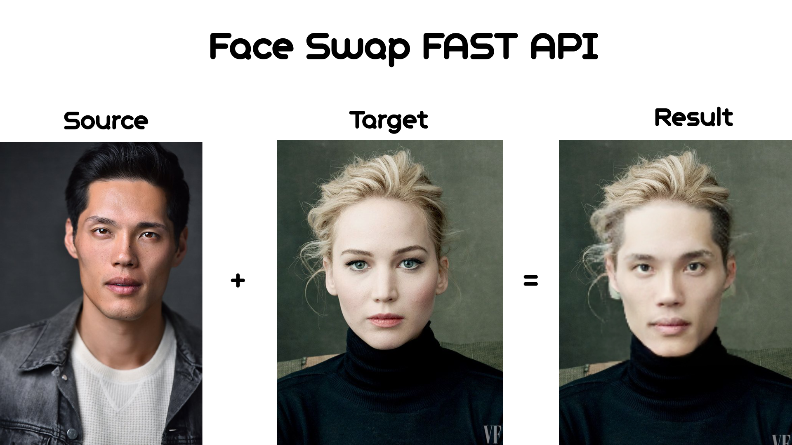

</div>
## Requirements

- Python 3.9+
- Required libraries listed in `requirements.txt`

## Installation

1. Clone the repository
2. Install dependencies:
```bash
pip install -r requirements.txt
```

3. Download the required InsightFace model:

```powershell
# Install gdown if not already installed
pip install gdown

# Create the model directory
New-Item -ItemType Directory -Force -Path "$env:USERPROFILE\.insightface\models\"

# Download the model file
gdown https://drive.google.com/uc?id=1krOLgjW2tAPaqV-Bw4YALz0xT5zlb5HF -O "$env:USERPROFILE\.insightface\models\inswapper_128.onnx"
```


5. Configure environment variables (edit .env file)
```
MONGO_URI=
DB_NAME=
ADMIN_API_KEY=
TOKEN_EXPIRY_DAYS=
TMP_DIR=
OUTPUT_DIR=
IMAGE_RETENTION_HOURS=
BASE_URL=
```

6. Start MongoDB service

7. Run the API

```bash
uvicorn app.main:app --reload
```

## Directory Structure
```
app/
├── auth/                       # Authentication module
│   ├── token.py                # Token validation and dependency functions
│   └── __init__.py             # Package initialization
├── routes/                     # API endpoints definition
│   ├── faceswap.py             # Face swapping route handlers
│   ├── token.py                # Token management route handlers
│   ├── health.py               # Health check endpoint
│   └── __init__.py             # Package initialization
├── services/                   # Core business logic
│   ├── face_swap.py            # InsightFace-based face swapping 
│   ├── image_service.py        # Image storage and retrieval functionality
│   ├── token_service.py        # Token creation and management
│   └── __init__.py             # Package initialization
├── utils/                      # Utility functions
│   ├── cleanup.py              # Automatic file cleanup for expired images
│   └── __init__.py             # Package initialization
└── main.py                     # Application entry point and FastAPI setup
```
## API Endpoints

### Public Endpoint

- `GET /health`: Check API health status

### Admin Endpoints (require X-Admin-Key header)

- `POST /token`: Create a new API token
- `GET /token/{token_id}`: Get token details
- `DELETE /token/{token_id}`: Delete a token

### Secured Endpoints (require X-API-Key header)

- `POST /faceswap`: Swap faces between two images
- `GET /images/{filename}`: Retrieve a processed image

## Testing with Postman/cURL

This section provides testing instructions for all API endpoints.

### Public Endpoint Testing

#### Health Check
```bash
curl -X GET http://localhost:8000/health
```


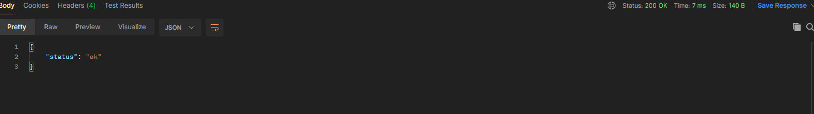

### Admin Endpoint Testing

For all admin requests, replace `your-admin-key` with your actual admin key.

#### Create Token
```bash
curl -X POST http://localhost:8000/token \
  -H "X-Admin-Key: your-admin-key"
```

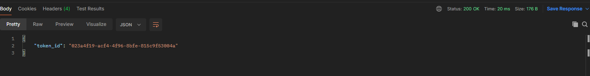

#### Get Token Details
```bash
curl -X GET http://localhost:8000/token/{token_id} \
  -H "X-Admin-Key: your-admin-key"
```

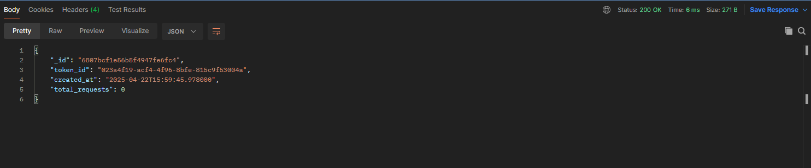

#### Delete Token
```bash
curl -X DELETE http://localhost:8000/token/{token_id} \
  -H "X-Admin-Key: your-admin-key"
```


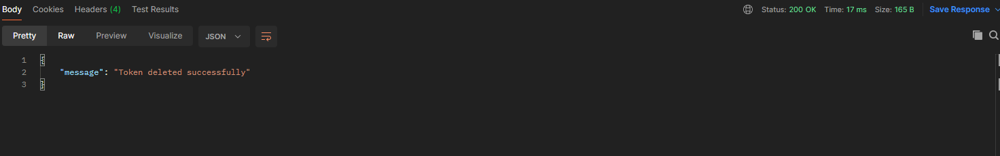

### Secured Endpoint Testing

Replace `{token_id}` with an actual valid token ID.

#### Face Swap Curl Command
```bash
curl -X POST http://localhost:8000/faceswap \
  -H "X-API-Key: {token_id}" \
  -F "source_image=@/path/to/source.jpg" \
  -F "target_image=@/path/to/target.jpg"
```
or
#### Face Swap .py test file

```bash
import requests

url = "http://localhost:8000/faceswap"
token = "your-token-id"
source_path = r"Path1"
target_path = r"Path2"

headers = {
    "X-API-Key": token
}

with open(source_path, "rb") as source_file, open(target_path, "rb") as target_file:
    files = {
        "source_image": ("model1.jpg", source_file, "image/jpeg"),
        "target_image": ("model2.jpg", target_file, "image/jpeg")
    }
    
    response = requests.post(url, headers=headers, files=files)
    
    print(f"Status code: {response.status_code}")
    print(f"Response: {response.text}")
```


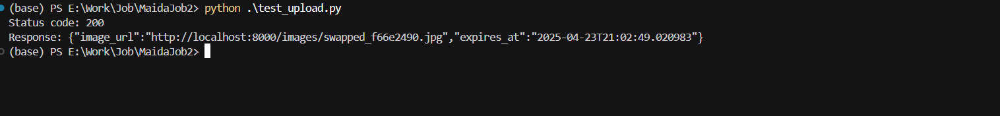


#### Retrieve Swapped Image
```bash
curl -X GET http://localhost:8000/images/swapped_a1b2c3d4.jpg
```


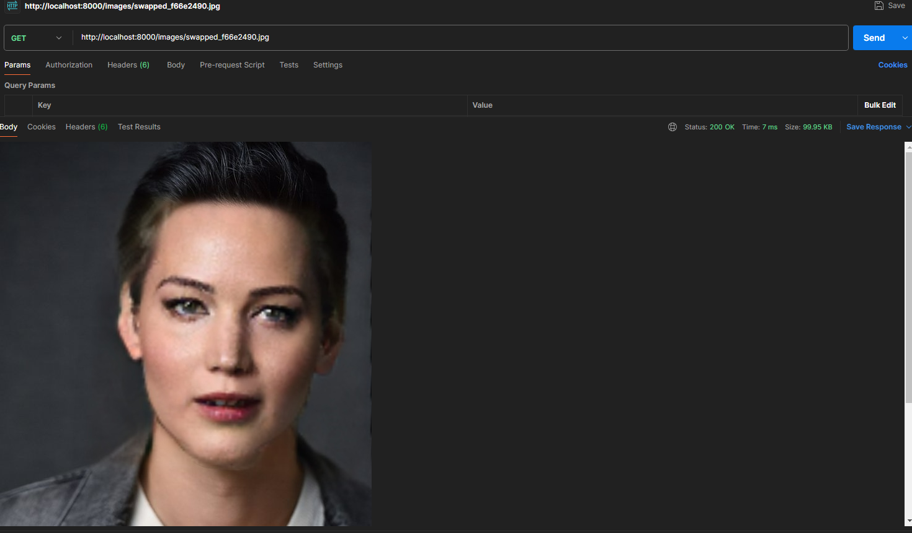

### Validation Testing

#### Testing Invalid Admin Key
```bash
curl -X POST http://localhost:8000/token \
  -H "X-Admin-Key: invalid-key"
```


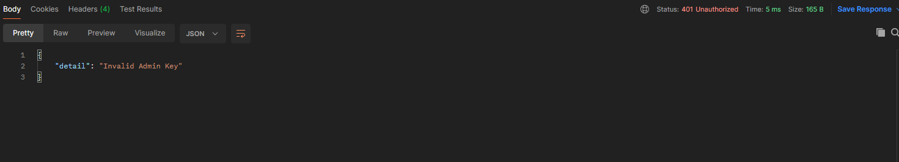

#### Testing Invalid API Token
```bash
curl -X POST http://localhost:8000/faceswap \
  -H "X-API-Key: invalid-token" \
  -F "source_image=@/path/to/source.jpg" \
  -F "target_image=@/path/to/target.jpg"
```


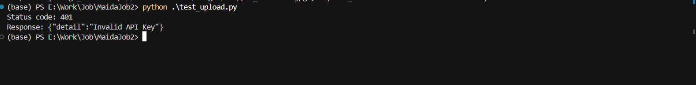

#### Verifying Token Usage Tracking
```bash
# After using a token for multiple face swaps:
curl -X GET http://localhost:8000/token/{token_id} \
  -H "X-Admin-Key: your-admin-key"
```


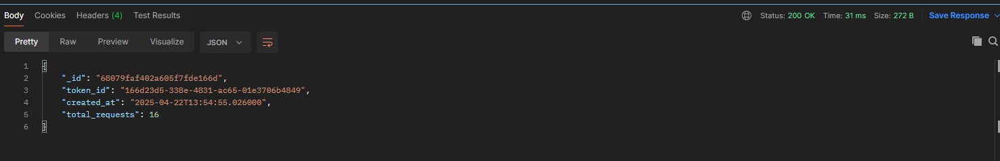

### Edge Case Testing

#### Face Detection Failure
```bash
curl -X POST http://localhost:8000/faceswap \
  -H "X-API-Key: {token_id}" \
  -F "source_image=@/path/to/no_face.jpg" \
  -F "target_image=@/path/to/target.jpg"
```


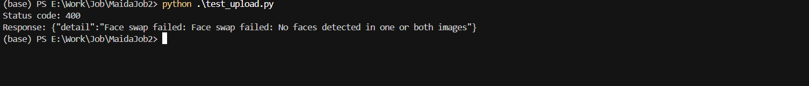


## Security Considerations

- Use strong, unique values for admin key
- Keep your MongoDB instance secure
- Set up proper firewall rules for your API server
- Consider implementing rate limiting for production use

